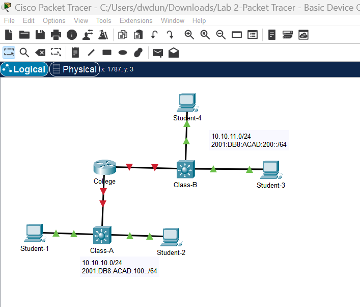
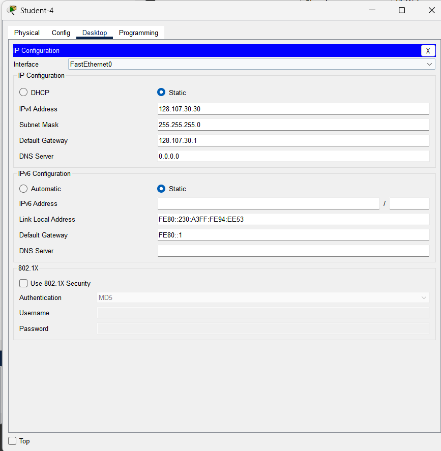
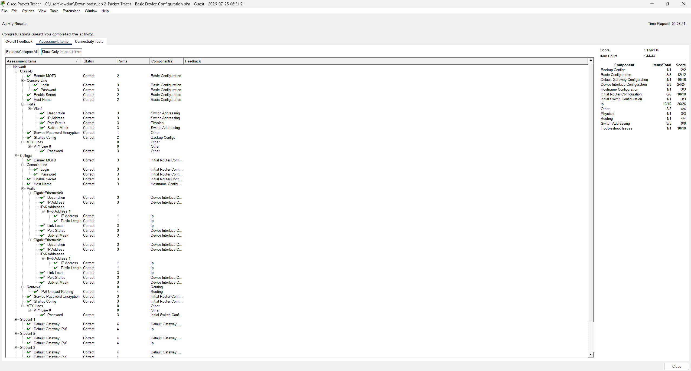

# Packet Tracer Lab 2 - Basic Device Configuration

This lab introduced basic Cisco IOS configuration using Packet Tracer. The goal was to configure a router, a switch, and several hosts to establish full IPv4 and IPv6 connectivity between two LANs.

## Objectives

- Configure a Cisco router using the IOS CLI
- Configure a Layer 2 switch for management access
- Configure IPv4 and IPv6 addressing
- Configure passwords and security settings
- Verify end-to-end connectivity
- Save device configurations

## Initial Topology

The lab consisted of two LANs connected by a router. Each LAN contained a switch and two hosts.



## Completing the Addressing Table

The lab provided most IP addresses but left the default gateways blank. These were determined from the router interfaces.

| Network | IPv4 Gateway | IPv6 Gateway |
|---------|--------------|--------------|
| 128.107.20.0/24 | 128.107.20.1 | FE80::1 |
| 128.107.30.0/24 | 128.107.30.1 | FE80::1 |

The PCs were configured using the **Desktop → IP Configuration** utility.



## Router Configuration

The router was configured entirely through the Cisco IOS CLI.

Major tasks included:

- Setting the hostname
- Configuring the enable secret
- Configuring console and VTY passwords
- Encrypting passwords
- Creating a MOTD banner
- Configuring IPv4 and IPv6 addresses on both interfaces
- Enabling IPv6 routing
- Saving the running configuration

One of the biggest lessons from this lab was learning the IOS configuration modes:

```text
Router>
Router#
Router(config)#
Router(config-if)#
```

Understanding which mode I was in made troubleshooting much easier.

## Switch Configuration

The Class-B switch was configured with:

- Hostname
- Enable secret
- Console password
- VTY password
- Password encryption
- MOTD banner
- VLAN 1 management interface
- IPv4 and IPv6 management addresses
- Default gateway
- Saved startup configuration

Unlike the router, the switch's management IP address was assigned to **VLAN 1**, not to a physical Ethernet port.

## Challenges

This lab assumed prior knowledge of Cisco IOS commands, which made the initial learning curve fairly steep.

Some of the concepts that took time to understand included:

- The difference between User EXEC, Privileged EXEC, and Global Configuration modes
- Why routers do not use `ip default-gateway`
- Why Layer 2 switches use `interface vlan 1`
- Saving configurations with:

```text
copy running-config startup-config
```

## Final Results

After troubleshooting the remaining VLAN configuration issues, the activity completed with a perfect score.



## Reflection

This was my first experience configuring Cisco devices entirely from the command line. Although the lab was initially frustrating, it became much easier once I understood how IOS configuration modes work and how routers and switches differ in their management configuration.

The biggest takeaway from this lab was learning to read the command prompt carefully. The current prompt (`>`, `#`, `(config)#`, or `(config-if)#`) determines which commands are valid and what device component is currently being configured.